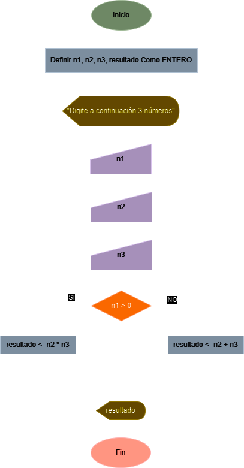

# Ejercicio No. 1: Suma o Producto

Diseñe un algoritmo que lea tres números y, si el primero es positivo calcule el producto de los otros dos, y en otro caso, calcule la suma y muestre el resultado en pantalla.

## Solución

<table width="100%">
  <thead>
    <tr>
      <th>Datos</th>
      <th>Descripción</th>
      <th>Identificadores</th>
    </tr>
  </thead>
  <tbody>
    <tr>
      <td><strong>Entrada</strong></td>
      <td></td>
      <td></td>
    </tr>
    <tr>
      <td>Número 1</td>
      <td>Primer número</td>
      <td>n1</td>
    </tr>
    <tr>
      <td>Número 2</td>
      <td>Segundo número</td>
      <td>n2</td>
    </tr>
    <tr>
      <td><strong>Salida</strong></td>
      <td></td>
      <td></td>
    </tr>
    <tr>
      <td>Resultado</td>
      <td>Resultado final</td>
      <td>n3</td>
    </tr>
  </tbody>
</table>

### Diagrama de flujo

<p align="center">
  
</p>

### Pseudo codigo

```
ALGORITMO SumaOProducto;
VAR
	ENTERO n1;
	ENTERO n2;
	ENTERO n3;
	ENTERO resultado;
INICIO
	ESCRIBIR(“Digite a continuación 3 números”);
	LEER(n1);
	LEER(n2);
	LEER(n3);
	SI (n1 > 0)
		resultado <- n2 * n3;
	SINO
		resultado <- n2 + n3;
	FINSI
	ESCRIBIR(resultado);
FIN
```

### Codigo real

- **Python:** [ejercicio_1.py](./ejercicio_1.py)
