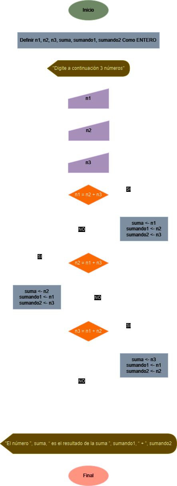

# Ejercicio No. 2: Suma de otros Dos

Diseñe un algoritmo que lea tres números enteros y decida si uno de ellos coincide con la suma de los otros dos.

## Solución

| **Datos**   | **Descripción**   | **Identificadores** |
|-------------|-------------------|---------------------|
| **Entrada** |                   |                     |
| Número 1    | Primer número     | n1                  |
| Número 2    | Segundo número    | n2                  |
| Número 3    | Tercer número     | n3                  |
| **Salida**  |                   |                     |
| Suma        | Suma de otros dos | suma                |
| Sumando 1   | Primer sumando    | sumando1            |
| Sumando 2   | Segundo sumando   | sumando2            |

### Diagrama de flujo

<p align="center">
    
</p>

### Pseudo código

```
ALGORITMO SumaOtrosDos;
VAR
	ENTERO n1;
	ENTERO n2;
	ENTERO n3;
	ENTERO suma;
	ENTERO sumando1;
	ENTERO sumando2;
INICIO
	ESCRIBIR(“Digite a continuación 3 números”);
	LEER(n1);
	LEER(n2);
	LEER(n3);
	SI (n1 = n2 + n3)
		suma <- n1;
		sumando1 <- n2;
		sumando2 <- n3;
	FINSI
	SI (n2 = n1 + n3)
		suma <- n2;
		sumando1 <- n1;
		sumando2 <- n3;
	FINSI
	SI (n3 = n1 + n2)
		total <- n3;
		sumando1 <- n1;
		sumando2 <- n2;
	FINSI
	ESCRIBIR(“El número ”, suma, “ es ”, sumando1, “ + ”, sumando2);
FIN
```

### Código real

- **Python:** [suma_de_otros_dos.py](./suma_de_otros_dos.py)
