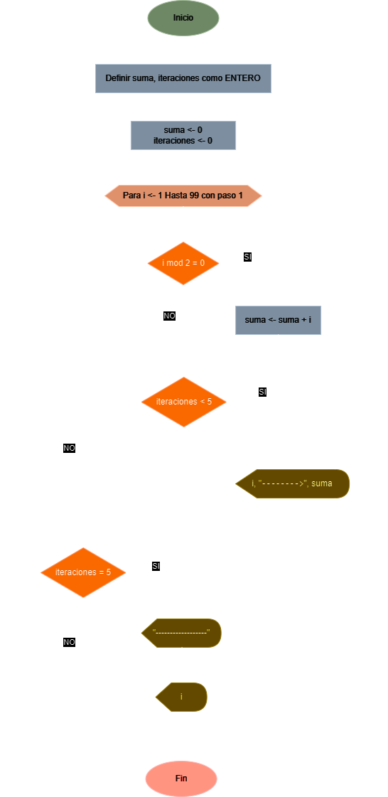

# Ejercicio No. 3: Multiplos de Tres

Diseñe un algoritmo que imprima y sume la serie de números múltiplos de 3 hasta 100, es decir, 3, 6, 9, 12, ... 99 (usar ciclos).  Realizar la traza para las primeras cinco iteraciones.

## Solución

Diseñe un algoritmo que presenta en pantalla todas las potencias enteras de 2 que sean menores o iguales que 100 (usar ciclos).

| **Datos**      | **Descripción**             | **Identificadores** |
|----------------|-----------------------------|---------------------|
| **Intermedio** |                             |                     |
| Iteraciones    | Iteraciones del ciclo       | iteraciones         |
| **Salida**     |                             |                     |
| Suma total     | Suma de todos los multiplos | suma                |

### Diagrama de flujo

<p align="center">
    
</p>

### Pseudo código

```
ALGORITMO MultiplosDeTres;
VAR
	ENTERO suma;
	ENTERO iteraciones;
INICIO
	suma <- 0;
	iteraciones <- 0;

	PARA (i<-1) HASTA (99) CON PASO (1) HACER
		SI ((i mod 3) = 0)
			suma <- suma + i;
			SI (iteraciones < 5)
				ESCRIBIR(i, “-------->”, suma);
			SINO
				SI (iteraciones = 5)
					ESCRIBIR(“------------------”);
				FINSI
				ESCRIBIR(i);
			FINSI
			iteraciones <- iteraciones + 1;
		FINSI
	FINPARA
	ESCRIBIR(“Suma total: ”, suma);
FIN
```

### Código real

- **Python:** [multiplos_de_tres.py](./multiplos_de_tres.py)
- **Java:** [MultiplosDeTres.java](./MultiplosDeTres.java)
