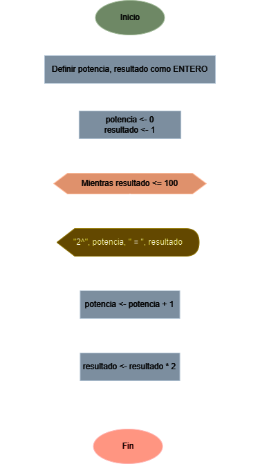

# Ejercicio No. 4: Potencias de Dos

Diseñe un algoritmo que presenta en pantalla todas las potencias enteras de 2 que sean menores o iguales que 100 (usar ciclos).

## Solución:

| **Datos**      | **Descripción**               | **Identificadores** |
|----------------|-------------------------------|---------------------|
| **Intermedio** |                               |                     |
| Potencia       | Exponente actual de 2         | potencia            |
| Resultado      | Resultado de la potencia de 2 | resultado           |

### Diagrama de flujo

<p align="center">
    
</p>

### Pseudo código

```
ALGORITMO PotenciasDeDos;
VAR
    ENTERO potencia;
    ENTERO resultado;
INICIO
    potencia <- 0;
    resultado <- 1;
    MIENTRAS resultado <= 100 HACER
        ESCRIBIR("2^", potencia, " = ", resultado);
        potencia <- potencia + 1;
        resultado <- resultado * 2;
    FINMIENTRAS
FIN
```

### Código real

- **Python:** [potencias_de_dos.py](./potencias_de_dos.py)
- **Java:** [PotenciasDeDos.java](./PotenciasDeDos.java)
