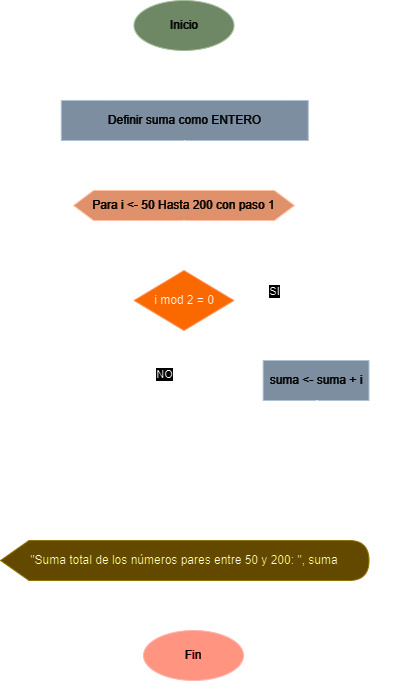

# Ejercicio No. 5: Suma de Números Pares entre 50 y 200

Diseñe un algoritmo que sume los números pares comprendidos entre 50 y 200, inclusive.

## Solución

| **Datos**      | **Descripción**                                | **Identificadores** |
|----------------|------------------------------------------------|---------------------|
| **Intermedio** |                                                |                     |
| Iterador       | Iterador del ciclo                             | i                   |
| **Salida**     |                                                |                     |
| Suma Total     | Suma total de los números pares entre 50 y 200 | suma                |

### Diagrama de flujo

<p align="center">
    
</p>

### Pseudo código

```
ALGORITMO NumerosParesEntre50Y200
VAR
    ENTERO suma;
INICIO
    suma <- 0;

    PARA (i <- 50) HASTA (200) CON PASO (1) HACER
        SI ((i mod 2) = 0) ENTONCES
            suma <- suma + i;
        FINSI
    FINPARA

    ESCRIBIR("Suma total de los números pares entre 50 y 200: ", suma);
FIN
```

### Código real

- **Python:** [suma_pares_50_y_200.py](./suma_pares_50_y_200.py)
- **Java:** [SumaPares50Y200.java](./SumaPares50Y200.java)
