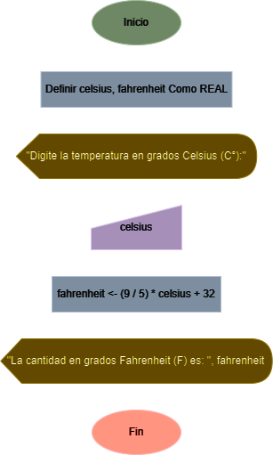

# Grados Celsius a Fahrenheit

Diseñe un algoritmo que lea la temperatura en grados Celsius (C°) y la escriba en Fahrenheit (F).

## Solución

| **Datos**         | **Descripción**                                        | **Identificadores** |
|-------------------|--------------------------------------------------------|---------------------|
| **Entrada**       |                                                        |                     |
| Grados celsius    | Temperatura en grados Celsius ingresada por el usuario | celsius             |
| **Salida**        |                                                        |                     |
| Grados Fahrenheit | Temperatura convertida a grados Fahrenheit             | fahrenheit          |

### Diagrama de flujo

<p align="center">
    
</p>

### Pseudo código

```
ALGORITMO CelsiusAFahrenheit;
VAR
	REAL celsius;
	REAL fahrenheit;
INICIO
	ESCRIBIR(“Digite la temperatura en grados Celsius (C°): ”);
	LEER(celsius);
	fahrenheit <- (9 / 5) * celsius + 32;
	ESCRIBIR(“La cantidad en grados Fahrenheit (F) es: ”, fahrenheit);
FIN
```

### Código real

- **Python:** [celsius_a_fahrenheit.py](./celsius_a_fahrenheit.py)
- **Java:** [CelsiusAFahrenheit.java](./CelsiusAFahrenheit.java)
