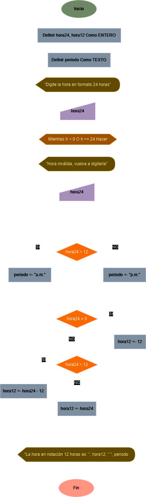

# Ejercicio No. 7: Notación 24 a notación 12 horas

Diseñe un algoritmo que lea la hora de un día de notación de 24 horas y la respuesta en notación de 12 horas, por ejemplo, si la ENTRADA es 13, la salida será 1 p.m.

## Solución

| **Datos**       | **Descripción**                                   | **Identificadores** |
|-----------------|---------------------------------------------------|---------------------|
| **Entrada**     |                                                   |                     |
| Hora formato 24 | Hora en formato 24 horas ingresada por el usuario | hora24              |
| **Salida**      |                                                   |                     |
| Hora formato 12 | Hora convertida a formato 12 horas                | hora12              |
| Periodo         | Periodo a.m./p.m.                                 | periodo             |

### Diagrama de flujo

<p align="center">
    
</p>

### Pseudo código

```
VAR
    ENTERO hora24;
    ENTERO hora12;
    TEXTO periodo;
INICIO
    ESCRIBIR("Digite la hora en formato 24 horas");
    LEER(hora24);

    MIENTRAS (h < 0 O h >= 24) HACER
        ESCRIBIR("Hora inválida, vuelva a digitarla");
        LEER(hora24);
    FINMIENTRAS

    SI (hora24 < 12)
        periodo <- "a.m.";
    SINO
        periodo <- "p.m.";
    FINSI

    SI (hora24 = 0)
        hora12 <- 12;
    SINOSI (hora24 > 12)
        hora12 <- hora24 - 12;
    SINO
        hora12 <- hora24;
    FINSI

    ESCRIBIR("La hora en notación 12 horas es: ", hora12, " ", periodo);
FIN
```

### Código real

- **Python:** [notacion_24_a_12.py](./notacion_24_a_12.py)
- **Java:** [Notacion24A12.java](Notacion24A12.java)
